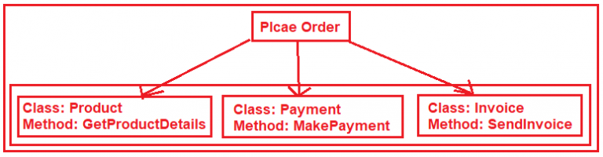

`Facade`
==========

Objetivo
-------

O objetivo principal de um Facade Pattern não é evitar que você tenha que ler o
manual de uma API complexa. É apenas um efeito colateral. O primeiro objetivo é
reduzir o acoplamento e seguir a Lei de Demeter.

Um Facade tem o objetivo de desacoplar um cliente e um subsistema ao incorporar
muitas (mas às vezes apenas uma) interface e, claro, para reduzir
complexidade.

- Um Facade não proíbe o acesso ao subsistema
- Você pode (você deve) ter vários Facade para um subsistema

É por isso que uma bom Facade não contém `` novo``. Se houver várias
criações para cada método, não é um Facade, é um construtor ou um
[Abstract\|Static\|Simple] Factory [Method].

O melhor Facade não tem `` new`` e um construtor com
parâmetros sugeridos pelo tipo de interface. Se você precisa da criação de novas instâncias,
use um Factory como argumento. 

O que é o padrão de design de fachada em C #?
---------------------------------------------

De acordo com a definição do GOF, o Facade Design Pattern afirma que você precisa fornecer uma interface unificada para um conjunto de interfaces em um subsistema. O Façade Design Pattern define uma interface de nível superior que torna o subsistema mais fácil de usar.

Em palavras simples, podemos dizer que o Facade Design Pattern é usado para ocultar as complexidades de um sistema e fornece uma interface para o cliente através da qual o cliente pode acessar o sistema. O Façade (geralmente um invólucro) fica no topo de um grupo de subsistemas e permite que eles se comuniquem de uma maneira unificada. 

Compreendendo o Facade Design Pattern em C# com um exemplo em tempo real: 
-----------

Vamos entender o Façade Design Pattern com um exemplo em tempo real. Por favor, dê uma olhada no diagrama a seguir. Aqui, precisamos projetar um aplicativo para fazer um pedido. 

   

Conforme mostrado na imagem acima, para fazer um pedido primeiro precisamos criar um objeto da classe Produto e obter os detalhes do produto. Então se tudo estiver bem então precisamos fazer o Pagamento e para isso, precisamos criar uma instância da classe Pagamento e chamar o método MakePayment. Se o pagamento for bem sucedido, então precisamos enviar a fatura para o cliente. Portanto, para fazer o pedido, precisamos seguir os passos mencionados acima.

O Facade é, na verdade, uma classe extra que fica no topo da classe de método acima. Por favor, dê uma olhada no diagrama a seguir. 

.. imagem:: img/c-users-pranaya-pictures-facade-design-pattern-im-768x240.png
   :alt: Alt AbstractFactory UML Diagram
   :align: center

Portanto, aqui a classe extra Ordem é a classe Facade que se responsabiliza pela realização do pedido. Essa classe cria internamente a instância das respectivas classes e chama o método. 

Compreendendo o diagrama de classes do padrão de projeto de fachada em C #: 
---------------------------------------------------------------------------

Vamos entender o diagrama de classes e os diferentes componentes envolvidos no padrão de projeto de Facade em C#. Para entender o diagrama de classes do Facade Design Pattern, dê uma olhada na imagem a seguir. 

.. imagem:: img/c-users-pranaya-pictures-facade-design-pattern-in.png
   :alt: Alt AbstractFactory UML Diagram
   :align: center
  

Conforme mostrado na imagem acima, existem duas classes envolvidas no Padrão de Projeto Facade. Eles são os seguintes:

1. A classe Façade sabe quais classes de subsistema são responsáveis por uma determinada solicitação e então delega as solicitações do cliente aos objetos de subsistema apropriados.
2. As classes de subsistema implementam suas respectivas funcionalidades atribuídas a elas e esses subsistemas não possuem nenhum conhecimento da fachada.

Nota: O padrão Facade é usado muitas vezes inconscientemente em nossos projetos, mesmo que não estejamos cientes disso. Este é um dos padrões de design mais úteis. Se você entende o Padrão de Projeto Facade, então você tornará a arquitetura do projeto melhor. 

Implementando o Padrão de Projeto Facade em C#: 
----

Vamos implementar o exemplo que discutimos passo a passo usando o Padrão de Projeto Facade em C#. 

